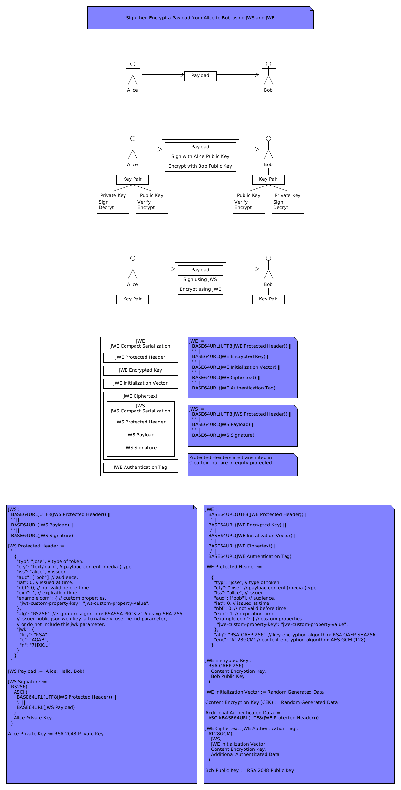

# About

Sign then Encrypt a Payload from Alice to Bob using [JSON Web Signature (JWS)](https://datatracker.ietf.org/doc/html/rfc7515) and [JSON Web Encryption (JWE)](https://datatracker.ietf.org/doc/html/rfc7516) in a Go application using the [lestrrat-go/jwx/v2 library](https://github.com/lestrrat-go/jwx).

# References

* [RFC 7515: JSON Web Signature (JWS)](https://datatracker.ietf.org/doc/html/rfc7515).
* [RFC 7516: JSON Web Encryption (JWE)](https://datatracker.ietf.org/doc/html/rfc7516).
* [RFC 7517: JSON Web Key (JWK)](https://datatracker.ietf.org/doc/html/rfc7517).
* [RFC 7518: JSON Web Algorithms (JWA)](https://datatracker.ietf.org/doc/html/rfc7518).
* [RFC 7519: JSON Web Token (JWT)](https://datatracker.ietf.org/doc/html/rfc7519).
* [RFC 7520: Examples of Protecting Content Using JSON Object Signing and Encryption (JOSE)](https://datatracker.ietf.org/doc/html/rfc7520).
